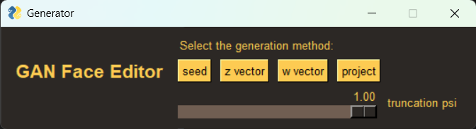
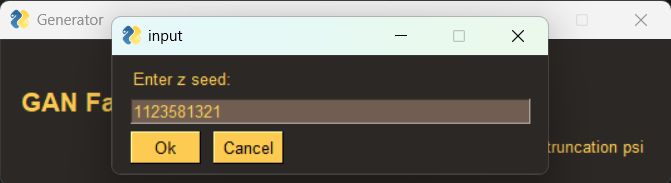
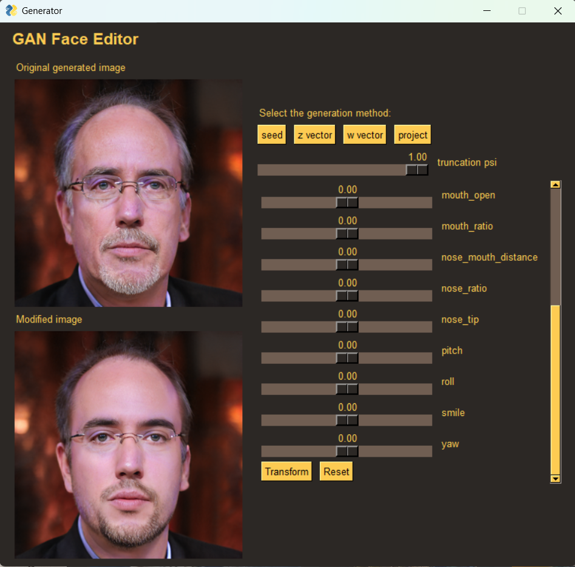
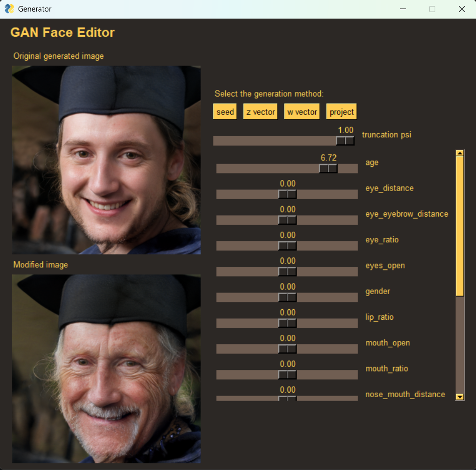
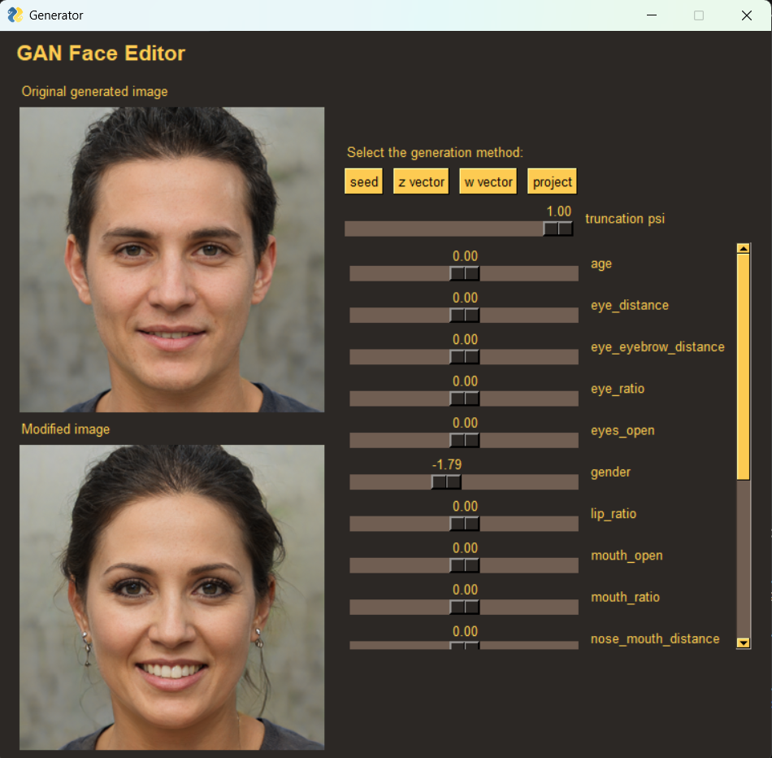
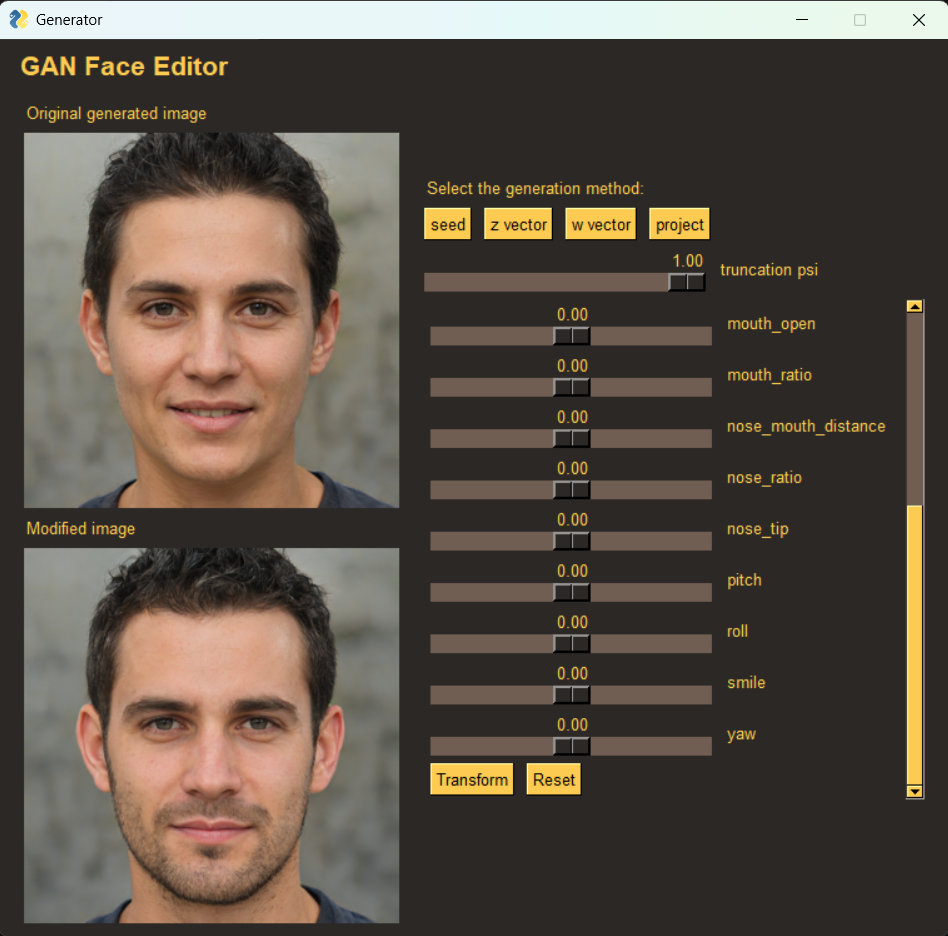
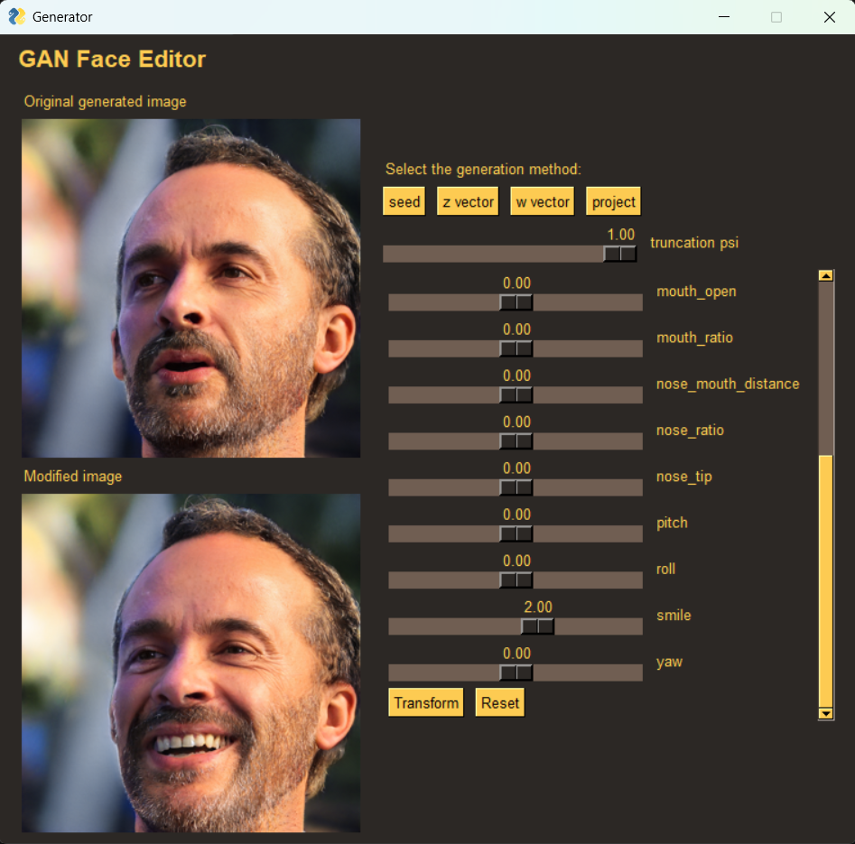
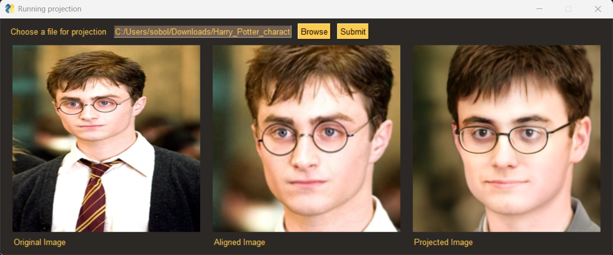
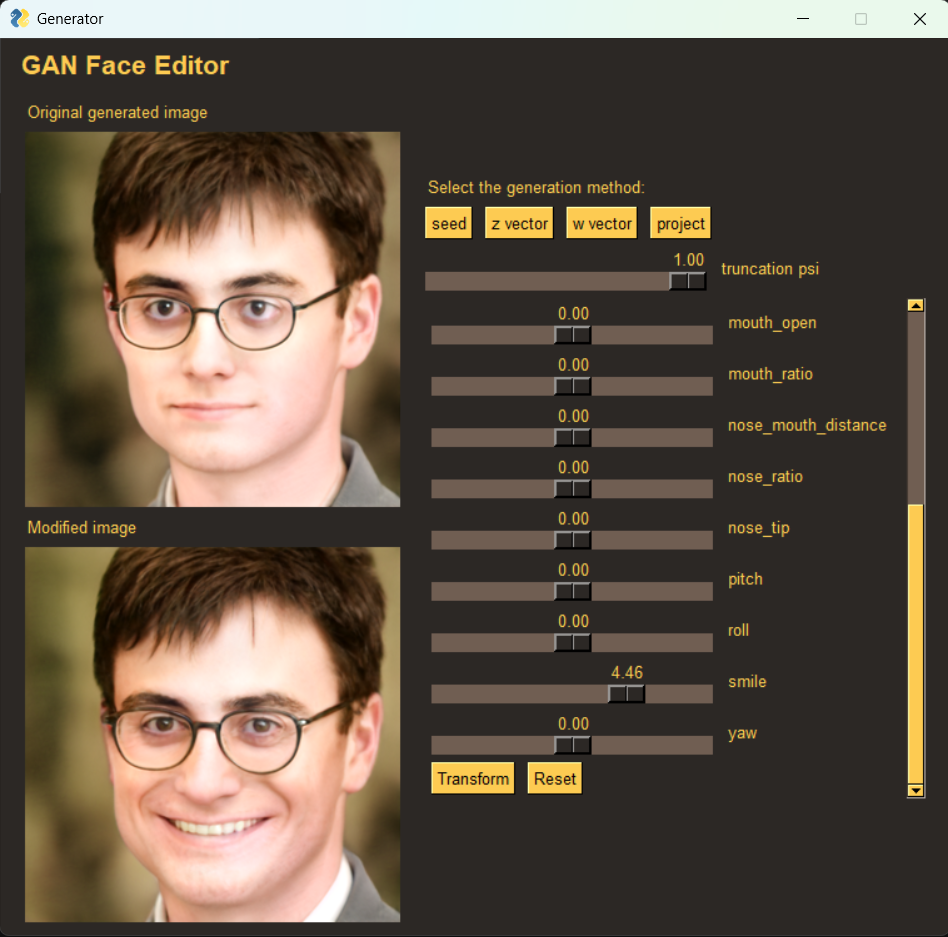

# GAN Face Editor

A powerful desktop application for generating and editing realistic human faces using StyleGAN2-ADA. This project demonstrates the practical application of Generative Adversarial Networks (GANs) for face manipulation and generation.



## Features

- **Face Generation**: Generate realistic human faces from random seeds or latent vectors
- **Face Editing**: Modify facial attributes like age, gender, smile, and more
- **Face Projection**: Project real images into the StyleGAN latent space
- **Interactive GUI**: User-friendly interface for easy manipulation
- **Real-time Preview**: See changes instantly as you adjust parameters
- **Vector Reuse**: Save and reuse projected latent vectors for future editing

## Key Capabilities

### Face Generation
Generate unique, realistic faces using different methods:
- Random seed generation
- Z-vector based generation
- W-vector based generation



### Face Editing
Modify various facial attributes with precise control:

#### Age Transformation



#### Gender Transformation



#### Expression and Pose


### Face Projection and Editing
Project real images into the StyleGAN latent space and modify them:

#### Projection Process
1. Original Image
2. Aligned Image
3. Projected Image
4. Optimization Process



#### Understanding Projection Limitations
When projecting a real image into StyleGAN2-ADA’s latent space, the result is not a pixel-perfect match. Instead, the goal is to find a latent vector `w ∈ W+` such that the generated image `G(w)` closely resembles the original in a perceptual sense.

#### Why Differences Occur

- **Latent Space Limits**: StyleGAN’s latent space, trained on datasets like FFHQ, can only express faces within its learned distribution. Unusual features may not be fully captured.

- **Optimization Trade-offs**: The projection minimizes a loss combining perceptual similarity (`LPIPS`), pixel difference (`L2`), and regularization toward the average latent (`‖w − w_avg‖²`). This balances realism with accuracy.

- **Generator Bias**: StyleGAN tends to "correct" details to fit its training priors—adjusting skin, lighting, or symmetry. These changes ensure the result remains editable and realistic.


#### Projection Video
The following video shows the optimization process of projecting a real image into the StyleGAN latent space:

https://user-images.githubusercontent.com/yourusername/GAN-Face-Editor/main/assets/proj.mp4

#### Post-Projection Editing
After successful projection, we can modify the projected image:



#### Saving and Reusing Projected Vectors
When you project an image, the application automatically saves:
- The projected W-vector as `generated/projected_w.npy`
- The final projected image as `generated/proj.png`
- The optimization process video as `generated/proj.mp4`

You can later load these saved W-vectors using the "w vector" option in the interface to continue editing the same face with different attributes.

## Technical Details

### Architecture
- Built using PyTorch and StyleGAN2-ADA
- Implements a custom GUI using PySimpleGUI
- Uses dlib for face alignment
- Incorporates VGG16 for feature extraction during projection

### Key Components
- **Generator**: Handles face generation using StyleGAN2
- **Shifter**: Manages latent space manipulation
- **Projector**: Projects real images into the latent space
- **Controller**: Coordinates between different components
- **GUI**: Provides an intuitive user interface

## Installation

1. Clone the repository:
```bash
git clone https://github.com/yourusername/GAN-Face-Editor.git
cd GAN-Face-Editor
```

2. Install dependencies:
```bash
pip install -r requirements.txt
```

3. Download required models:
```bash
mkdir models
cd models
wget https://nvlabs-fi-cdn.nvidia.com/stylegan2-ada-pytorch/pretrained/ffhq.pkl
wget http://dlib.net/files/shape_predictor_68_face_landmarks.dat.bz2
bzip2 -dv shape_predictor_68_face_landmarks.dat.bz2
cd ..
```

## Usage

Run the application:
```bash
python run.py
```

### Basic Operations
1. Generate a face using one of the available methods
2. Use sliders to modify facial attributes
3. Save or reset changes as needed
4. Project real images for editing
5. Load previously saved W-vectors for continued editing

## Project Structure
```
GAN-Face-Editor/
├── core/               # Core functionality
├── generated/          # Generated images and vectors
│   ├── proj.mp4       # Projection process video
│   ├── proj.png       # Projected image
│   └── projected_w.npy # Saved W-vector
├── gui/               # GUI components
├── models/            # Model checkpoints
├── utils/             # Utility functions
├── vectors/           # Latent vectors
└── settings/          # Configuration
```

## Technologies Used
- Python
- PyTorch
- StyleGAN2-ADA
- PySimpleGUI
- dlib
- VGG16

## License
This project is licensed under the MIT License - see the LICENSE file for details.

## Acknowledgments
- StyleGAN2-ADA by NVIDIA
- FFHQ dataset
- dlib library 